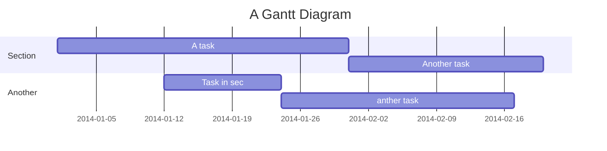

High Dimensional Effective Connectivity Estimation
===


# Misc.
1. Linux commands (can probs get rid of this documenation once auto file transfer script is completed)
    2. Remove all err folders in ANY child directory (use w/ caution!)
        3. rm -rf `find -type d -name err`

# Code To-Do
1. Update creation of submit files to match actual submit file settings.
2. Adapt allCondsProj parameter to specify which conditions to combine to create single projection space (I combine con/uncon conds)
3. Test dataLoops using multiple param vals... only tested for some params. Others have always been set to single value.
4. CHTC file transfer script
    5. Delete the fuck out of log/out/err folders
6. Add workaround to skip creation of dataEpochs files other than w/in local dag folder
7. When using maxSegs, there is a chance for redundant files (ad models, for that matter) to be outputted. Add workaround
8. change final output file of chtc pipeline to be finalModel.mat
9. clean this function up once all datasets are logged and chtc pipeline saves out files solely as finalModel.mat
    10. `            [~,chtc_out_dir,finalModelFile,fileExists]=getFinalModelDirFile(pars.dirs.baseResultsDir,pars.dataType.globalDataCat,...
            pars.dataType.varSelect,pars.dataType.catType,pars.dataType.dataID,pars.dataType.condition,pars);
10. dasdfasf`

    

# Table of Contents

[TOC]

# Program Overview
- Optimize VAR model's hyperparams with nested cross-validation (run through CHTC). 2 Hyperparams: model-order and lambda (group lasso sparsity weight).
- Apply PCA on individual ROI channel sets for dimensionality reduction
- Measure connectivity from model coefficients using block PDC/GC
- Test model validity: significant noise correlation, stability/stationarity
- Plot directed connectivity graphs
- Post-hoc
    - Run simulations based on experimentally fitted models to assess whether or not significant connections are retained after running PCA procedure

# Getting Started
## Data formatting
### 
- dataID
- globalDataCat
- varSelect
- catType


1.	Open batch_sparse_mvar_conn_analysis.m
a.	Set pars.dirs.localPath to the path leading to batch_sparse_mvar_conn_analysis.m e.g. pars.dirs.localPath='C:\Users\qualiaMachine\Documents\code\ \VAR\sparse_mvar_conn_toolbox_chtc\';
2.	Find setDirs.m file
a.	baseDataDir='A:\'; %'\\Odin\o\data\ecog_connectivity\'
b.	pars.dirs.baseCodeDir=pars.dirs.localPath;
c.	pars.dirs.baseResultsDir='R:\';%'\\MEMORYBANKS\Data\PassiveEphys\Analysis Results\Chris\ecog_connectivity\';
d.	pars.dirs.baseCondDataDir='G:\data'; % identical to batchParams dir at the moment
3.	Set pars for dataset in batch_sparse….m
a.	    %% test data
b.	    processNewData=true;
c.	    pars.dataLoops.dataIDs={'sample_nonStandFormat'}; % patients can be name of specific dataset you're trying to study. Patient for EEG stuff. broadDataCategory_sampleRate for other data types.
d.	    pars.dataLoops.varSelects={'ALLVARS'}; % if using a certain category of all vars in dataset, define here. e.g. subchannel region, only evoked channels, etc.
e.	    pars.dataLoops.catTypes={'catALL'};
f.	     
g.	    pars.dataType.sampleRate=1/(60*60*24); %daily. 
h.	    % epochLens given in seconds
i.	    pars.dataLoops.epochLens=pars.dataType.sampleRate*5;% 5 day epoch %5*60;%.33;%2;%1;%TrialProperties.Length;%[.25,.5,1,2,4,8,16];%TrialProperties.Length;
j.	    %
k.	    pars.dataLoops.globalDataCats={'daily'};%{'OR-RS'}
l.	    %
m.	    pars.dataType.shortenSeg.bool=false; % rather than analyze connectivity w/in each recording block (which can have mutliple OAAS readings), split up recording blocks into minute-long segments to derive models from each minute of data.
n.	    pars.dataType.shortenSeg.segLen=30/60; % length (in mins) of recording period to use for model fitting (gets divided into train/test sets)
o.	    pars.dataType.shortenSeg.startMin=0;%5.5; % 0=start from beginning of recording period, 1=start from minute1, and so on
p.	    %
q.	    pars.dataLoops.pcaBools=1;
r.	    pars.dataLoops.pcaPercs=.7;% percent variance to leave in PCA
4.	Set breakpoint at [batchParams]=getBatchParams_prepCondData(pars);
a.	Look at functions called by above function. Mimic batchParams_condData_FOREX.m to create your own script that reads in a dataset of interest. So long as spreadsheets are formatted properly, code in batchParams_condData_FOREX should by able to be repurposed for this.


# Program Settings
## setDirs.m
- baseDataDir='A:/'; % USE FORWARD SLASHES HERE so that bash script to handle input/output stuff still works. Windows doesn't care if slash is "wrong" direction.
- baseDataDir='O:/data/ecog_connectivity/'; 
- pars.dirs.baseResultsDir='M:/Endemann/ecog_connectivity/';%'//MEMORYBANKS/Data/PassiveEphys/Analysis Results/Chris/ecog_connectivity/';
- pars.dirs.baseCondDataDir='G:/data/'; % identical to batchParams dir at the moment
- ECoGdataDir='//Banksdesktop/d/Box Sync/PHI_Data-A5309-Banks/Banks-UIowa-LDS/My Documents/Data and analysis/ECoG data/';
- % pars.dirs.metadataDir=[ECoGdataDir 'ExperimentMetadata/'];
- pars.dirs.metadataDir=[pars.dirs.baseCodeDir 'ExperimentMetadata/'];
- pars.dirs.metadataDir='C:\Users\Endemann\Documents\ExperimentMetadata\';
- % pars.dirs.electrodeSpreadsheet=[ECoGdataDir filesep 'Electrode MNI coordinates and ROI' filesep];%[baseDataDir filesep 'electrode_file_sync' filesep 'Electrode MNI coordinates and ROI' filesep];
- % pars.dirs.electrodeSpreadsheet=[pars.dirs.baseCodeDir filesep];
- pars.dirs.electrodeSpreadsheet=pars.dirs.metadataDir;
- pars.dirs.base3rdPartyCode=[pars.dirs.baseCodeDir filesep '3rdPartyExtensions' filesep 'matlab' filesep];
- pars.dirs.dimRedData=[baseDataDir filesep 'dimRedCondData']; %A:/dimRedCondData
% tried to use regular results folder, but filepath is too long to use
% copy/movefile
- pars.dirs.baseCorruptDagDir=[baseDataDir filesep 'corruptedDags/'];
- pars.dirs.baseChtcDagDir=[baseDataDir filesep 'dags/'];
- pars.dirs.postHocAnalyze=[pars.dirs.baseCodeDir filesep 'analyze_final_models'];
- pars.dirs.simStuff='G:\data\simStuff\'; %dir for sim stuff (connMats of ground truth, etc.)
1. pars.dirs.chtcBaseDir=['/home/endemann/ecog_connectivity/dags']; % refers to folder where you store dags on CHTC server.
2. pars.dirs.baseLocalDagDir='O:\data\ecog_connectivity\dags';% dir to store all local dags

## setMainAnalysis.m

- createDag: create DAG structure to run jobs on CHTC
- localDag: run local version of DAG
- postHoc: model-validation connectivity metrics from fitted model params
- simData: flag to...
- summarizeDimRedEffects: create figs showing average 1-step error per channel when varying: PCA%, sparsity, model-order 
### createDag
### localDag
### postHoc
### simData
### summarizeDimRedEffects


## setExperiment.m
### Set Cross-Validation Procedure
- CV_lambda
- CV_p_lambda
- K: number of folds to use during 
### Set data batch params: dataID.globalDataCat.varSelect.catType
- dataIDs: List of subject IDs for most applications
- globalDataCats
- varSelect
- catType

## Other
- epochLen (seconds)
- sample-rate
- segLen (minutes): Length of time to spit data into for individual model-fitting
- zscore: turn zscoring on/off to standardize mean/variance across variables (account for variation in electrode contact, etc.)

### If using simulations...
### If using single segs...
setFitSingleSegPars(pars) % for some reason I am currently setting these params after plot param is set. 

## setParPool
If pars.run.bools.localDag=true, use setParPool.m to tell Matlab how many cores to use when running locally.

# Condor setup
1. Create pipeline folder, e.g. '/home/endemann/ecog_connectivity/'
2. Add folder for dags following this pattern: [pars.dirs.chtcBaseDir filesep 'dags']. Local dags will be dragged here. Folder structure: .../dags/globalDataType/varSelect/catType/... (same as local)
# Beginners Guide

If you are a total beginner to this, start here!

1. Visit hackmd.io
2. Click "Sign in"
3. Choose a way to sign in
4. Start writing note!

User story
---

```gherkin=
Feature: Guess the word

  # The first example has two steps
  Scenario: Maker starts a game
    When the Maker starts a game
    Then the Maker waits for a Breaker to join

  # The second example has three steps
  Scenario: Breaker joins a game
    Given the Maker has started a game with the word "silky"
    When the Breaker joins the Maker's game
    Then the Breaker must guess a word with 5 characters
```
> I choose a lazy person to do a hard job. Because a lazy person will find an easy way to do it. [name=Bill Gates]


```gherkin=
Feature: Shopping Cart
  As a Shopper
  I want to put items in my shopping cart
  Because I want to manage items before I check out

  Scenario: User adds item to cart
    Given I'm a logged-in User
    When I go to the Item page
    And I click "Add item to cart"
    Then the quantity of items in my cart should go up
    And my subtotal should increment
    And the warehouse inventory should decrement
```

> Read more about Gherkin here: https://docs.cucumber.io/gherkin/reference/

User flows
---
```sequence
Alice->Bob: Hello Bob, how are you?
Note right of Bob: Bob thinks
Bob-->Alice: I am good thanks!
Note left of Alice: Alice responds
Alice->Bob: Where have you been?
```

> Read more about sequence-diagrams here: http://bramp.github.io/js-sequence-diagrams/

Project Timeline
---


> Read more about mermaid here: http://knsv.github.io/mermaid/

# Appendix and FAQ

:::info
**Find this document incomplete?** Leave a comment!
:::

### tags: `Templates` `Documentation`
